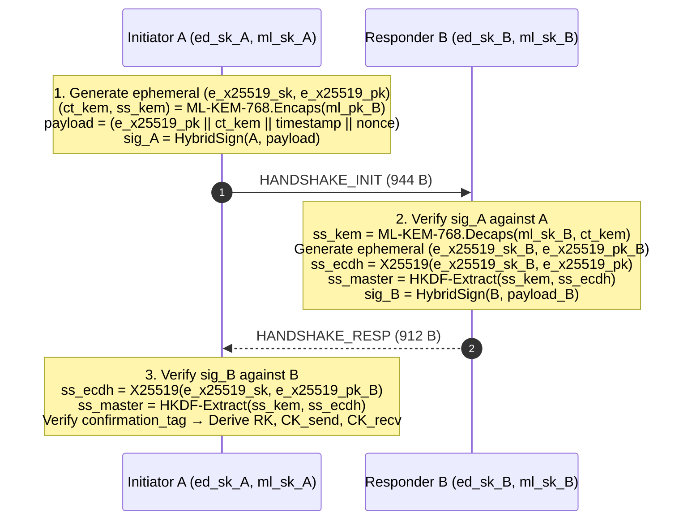

# Vantablack Formal Protocol Specification (v0.7.6)

This specification defines the cryptographic foundations, wire formats, state transition machines, and formal security theorems of the Vantablack overlay protocol. It is authored for independent cryptographers, security auditors, and formal verification engineers.

---

## 1. Cryptographic Primitive Portfolio

| Layer / Purpose | Primitive Standard | Key / Block Size | Resistance Bound |
|---|---|---|---|
| **Identity Signatures** | FIPS 204 ML-DSA-65 + Ed25519 | 1952B PK / 3309B Sig + 32B PK / 64B Sig | Post-Quantum Category 3 + Classical 128-bit |
| **Key Encapsulation** | FIPS 203 ML-KEM-768 + X25519 | 1184B PK / 1088B CT + 32B PK / 32B CT | Post-Quantum Category 3 + Classical 128-bit |
| **Payload AEAD** | XChaCha20-Poly1305 (RFC 8439) | 256-bit Key, 192-bit Nonce, 128-bit Tag | Classical 256-bit (Quantum Grover 128-bit) |
| **Key Derivation** | HKDF-SHA-256 (RFC 5869) | 256-bit PRK, variable OKM | Pre-image and collision resistant |
| **Erasure Coding** | Reed-Solomon RS(2,1) | $\text{GF}(2^8)$ Galois Field Arithmetic | MDS optimal (Singleton bound $n - k + 1 = 2$) |
| **Secret Sharing** | Shamir Threshold $(t=2, n=3)$ | Polynomials over $\text{GF}(256)$ | Information-Theoretically Secure |

---

## 2. Threat Model & Security Objectives

### 2.1 Adversary Classes
* **Active Dolev-Yao Adversary ($\mathcal{A}_{\text{DY}}$):** Controls the network entirely—can intercept, inject, delay, alter, and replay any datagram. Does not possess private keys or invert cryptographic primitives.
* **Quantum Harvest-Now-Decrypt-Later Adversary ($\mathcal{A}_{\text{Q}}$):** Records all wire ciphertexts indefinitely and subsequently acquires a Cryptographically Relevant Quantum Computer (CRQC) capable of executing Shor's algorithm ($O(\log N)$ factoring and discrete logs).
* **Traffic-Analytic Observer ($\mathcal{A}_{\text{TA}}$):** Passive eavesdropper monitoring packet lengths, inter-packet arrival times, and routing graphs across international gateways.

### 2.2 Security Objectives
1. **Confidentiality:** For any session payload $M$, $\Pr[\mathcal{A}(\text{Wire}) = M] \le \text{negl}(\lambda)$.
2. **Forward Secrecy & Break-In Recovery:** Compromise of long-term identity keys reveals no past session traffic; compromise of an ephemeral state is healed within one ratchet step.
3. **Space-Time Multi-Path Secrecy:** An adversary observing $k < 2$ network routes captures information-theoretically zero bits of the payload data.
4. **Indistinguishability of Cover Traffic:** Wire frame entropy satisfies $H(X) \ge 7.98$ bits/byte; statistical distance between data and dummy frames $\Delta \le 0.005$.

---

## 3. Hybrid Handshake Protocol

The handshake executes a dual-KEM exchange combining classical Elliptic Curve Diffie-Hellman (X25519) with module lattice encapsulation (ML-KEM-768).

### 3.1 Master Secret Composition
$$\text{ss}_{\text{hybrid}} = \text{HKDF-Extract}(\text{salt} = \text{ss}_{\text{kem}}, \text{ikm} = \text{ss}_{\text{ecdh}})$$
If either ML-KEM-768 or X25519 remains unbroken, $\text{ss}_{\text{hybrid}}$ is computationally indistinguishable from uniform randomness.

---

## 4. Continuous Ratchet & Quantum Entropy Epochs

Sessions advance through a continuous symmetric key ratchet. Every directional frame increments a 64-bit sequence counter. Epoch transitions occur periodically:

$$K_{\text{epoch}+1}, \text{RK}_{\text{epoch}+1} = \text{HKDF-Expand}(\text{RK}_{\text{epoch}}, \text{info} = \text{"GGN_RATCHET_EPOCH"} \mathbin{\Vert} \text{epoch} \mathbin{\Vert} \text{entropy}_{\text{QEL}})$$

When the Quantum Entropy Anchor (Layer 10) is active, $\text{entropy}_{\text{QEL}}$ injects 32 bytes of physical quantum key material (via ETSI GS QKD 014 or stabilizer measurement), rendering past and future epochs immune to compromised classical RNGs.

---

## 5. Reed-Solomon Space-Time Dispersal (Layer 4)

Let payload $M$ be framed as a byte string of length $2L$.
1. Partition into two equal data shards: $D_0 = M[0..L]$, $D_1 = M[L..2L]$.
2. Parity shard $P_0$ is derived over $\text{GF}(2^8)$:
   $$P_0 = D_0 \oplus D_1$$
3. Each shard $S_i \in \{D_0, D_1, P_0\}$ is sealed under an independent shard tag:
   $$\text{Frame}_i = \text{XChaCha20-Poly1305.Seal}(K_{\text{shard}, i}, \text{nonce}_i, S_i)$$
4. Shards travel across topologically disjoint paths. Reconstruction requires solving a linear system with $k=2$ equations and $k=2$ unknowns:
   * Case 1: $\{D_0, D_1\}$ present $\implies M = D_0 \mathbin{\Vert} D_1$.
   * Case 2: $\{D_0, P_0\}$ present $\implies D_1 = D_0 \oplus P_0 \implies M = D_0 \mathbin{\Vert} D_1$.
   * Case 3: $\{D_1, P_0\}$ present $\implies D_0 = D_1 \oplus P_0 \implies M = D_0 \mathbin{\Vert} D_1$.

---

## 6. ProVerif Formal Verification Mapping

The symbolic security claims are machine-checked using **ProVerif 2.05**:

| ProVerif Model | File Path | Proven Property | Result |
|---|---|---|:---:|
| `ghost_session.pv` | `formal/ghost_session.pv` | Session key secrecy against active attacker | `RESULT not attacker(secret[]) is true` |
| `ghost_session.pv` | `formal/ghost_session.pv` | Mutual cryptographic peer authentication | `RESULT inj-event(endA) ==> inj-event(beginB) is true` |
| `shardsec_split.pv`| `formal/shardsec_split.pv`| 1-shard wiretap reveals zero plaintext bits | `RESULT not attacker(reconstructed_payload[]) is true` |
