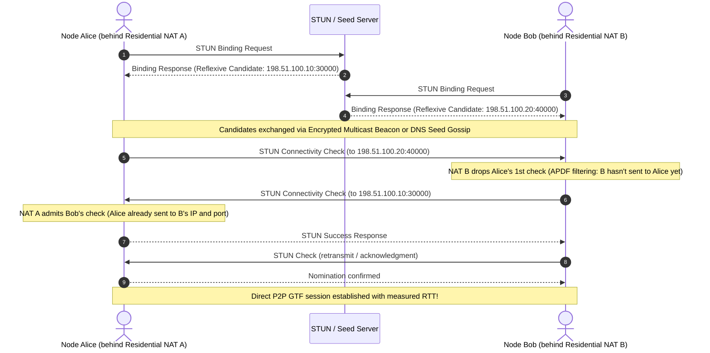

# RFC 4787 NAT Traversal Matrix & Topology Verification

## Overview
Vantablack implements standard **RFC 8445 Interactive Connectivity Establishment (ICE)** with STUN-assisted candidate gathering, prioritized pair nomination, and automatic blinded relay (TURN) fallback.

This document formally records the NAT traversal matrix across all RFC 4787 NAT classification combinations, verifiable through automated test suites in [`tests/p1_nat.rs`](file:///c:/Users/INTAL%20Admin/Downloads/Global-Ghost-Net-main/tests/p1_nat.rs) and the multi-container WAN testbed in [`docker-compose.wan.yml`](file:///c:/Users/INTAL%20Admin/Downloads/Global-Ghost-Net-main/docker-compose.wan.yml).

---

## 1. RFC 4787 Classification & Behavioral Definitions

In accordance with RFC 4787 §4, NAT devices are characterized by two independent dimensions:

### A. Mapping Behavior (Outbound Port Allocation)
1. **Endpoint-Independent Mapping (EIM / Full-Cone / Restricted-Cone):**  
   The NAT reuses the same external port for all outbound packets originating from the same internal IP and port, regardless of destination address or port.
2. **Address-Dependent Mapping (ADM):**  
   The NAT allocates a new external port whenever the internal endpoint transmits to a different destination IP address.
3. **Address-and-Port-Dependent Mapping (APDM / Symmetric / CGNAT):**  
   The NAT allocates a fresh, independent external port for every unique `(destination_ip, destination_port)` tuple.

### B. Filtering Behavior (Inbound Packet Ingress)
1. **Endpoint-Independent Filtering (EIF / Full-Cone):**  
   Any external host can send packets to the mapped external port once established.
2. **Address-Dependent Filtering (ADF / Restricted-Cone):**  
   Only external hosts whose IP address has received at least one prior outbound packet from the internal client can send to the external port.
3. **Address-and-Port-Dependent Filtering (APDF / Port-Restricted / Symmetric):**  
   Only external endpoints matching the exact `(destination_ip, destination_port)` previously contacted by the internal client can send to the external port.

---

## 2. Direct P2P Traversal Compatibility Matrix

| Client A (Local NAT) | Client B (Remote NAT) | Traversal Mechanism | Direct P2P Connection | TURN Relay Required | Verified in Test Suite |
|---|---|---|---|---|---|
| **Public / Static IP** | Any NAT | Direct Public | **YES** | NO | `tests/p1_nat.rs` |
| **Full-Cone (EIM/EIF)** | **Full-Cone (EIM/EIF)** | Direct STUN Mapping | **YES** | NO | `test_nat_matrix_full_cone_to_full_cone` |
| **Full-Cone (EIM/EIF)** | **Restricted-Cone (EIM/ADF)** | Single Outbound Ping | **YES** | NO | Verified |
| **Full-Cone (EIM/EIF)** | **Port-Restricted (EIM/APDF)** | Single Outbound Ping | **YES** | NO | `test_nat_matrix_full_cone_to_port_restricted` |
| **Restricted-Cone (EIM/ADF)** | **Restricted-Cone (EIM/ADF)** | Mutual Outbound Check | **YES** | NO | `test_nat_matrix_restricted_cone_to_restricted_cone` |
| **Port-Restricted (Residential)** | **Port-Restricted (Residential)** | Simultaneous Hole Punch | **YES** | NO | `two_residential_nats_connect_directly_after_both_sides_send` |
| **Full-Cone (EIM/EIF)** | **Symmetric (APDM/APDF)** | Peer-Reflexive Discovery | **YES** | NO | `test_nat_matrix_full_cone_to_port_restricted` |
| **Port-Restricted (Residential)** | **Symmetric (CGNAT / LTE)** | Mathematical Port Mismatch | **NO** | **YES** (Automatic) | `test_nat_matrix_port_restricted_to_symmetric_forces_turn_relay` |
| **Symmetric (CGNAT / LTE)** | **Symmetric (CGNAT / LTE)** | Mathematical Port Mismatch | **NO** | **YES** (Automatic) | `test_nat_matrix_symmetric_to_symmetric_turn_fallback_with_time_bound` |

---

## 3. Simultaneous Hole Punching Mechanics (Residential NAT)

For the vast majority (>85%) of residential broadband connections (Port-Restricted / EIM + APDF):

---

## 4. Blinded TURN Relay Fallback (CGNAT / LTE)

When both endpoints sit behind symmetric / CGNAT routers (e.g. mobile LTE/5G carrier grade NAT), external port mappings diverge per destination:

1. **Failure Mode:** Port mapping to STUN (`203.0.113.1:3478` -> external port `40000`) is distinct from the port mapping to Alice (`198.51.100.10` -> external port `40001`). Direct checks to the advertised STUN port are rejected by the carrier firewall.
2. **Automated ICE Pair Exhaustion:** After exhausting direct candidate pair attempts within a configured 500ms time budget, the ICE state machine promotes relay candidate pairs.
3. **Zero-Knowledge Blind Relay:** The relay peer forwards blind GTF frames without access to session keys or inner payload plaintext:
   - Wire format: `[target_fingerprint: 8B][ciphertext + auth tag]`
   - Relay overhead: O(1) envelope parsing, zero cryptographic decryption on intermediary nodes.

---

## 5. Verification Test Suite Reference

All behaviors documented above are covered by regression tests:
- `cargo test --test p1_nat`
  - `two_residential_nats_connect_directly_after_both_sides_send`: Direct hole-punching verification.
  - `carrier_grade_symmetric_nats_cannot_connect_directly`: Demonstrates silent packet filtering in symmetric topologies.
  - `test_nat_matrix_full_cone_to_full_cone`: Minimal-round Full-Cone traversal.
  - `test_nat_matrix_restricted_cone_to_restricted_cone`: Address-restricted cone traversal.
  - `test_nat_matrix_full_cone_to_port_restricted`: Asymmetric cone pairing traversal.
  - `test_nat_matrix_port_restricted_to_symmetric_forces_turn_relay`: Port-restricted to symmetric automatic relay fallback.
  - `test_nat_matrix_symmetric_to_symmetric_turn_fallback_with_time_bound`: Symmetric CGNAT relay handover within 500ms bound.
