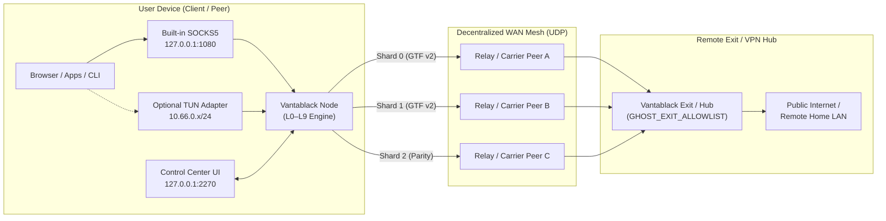
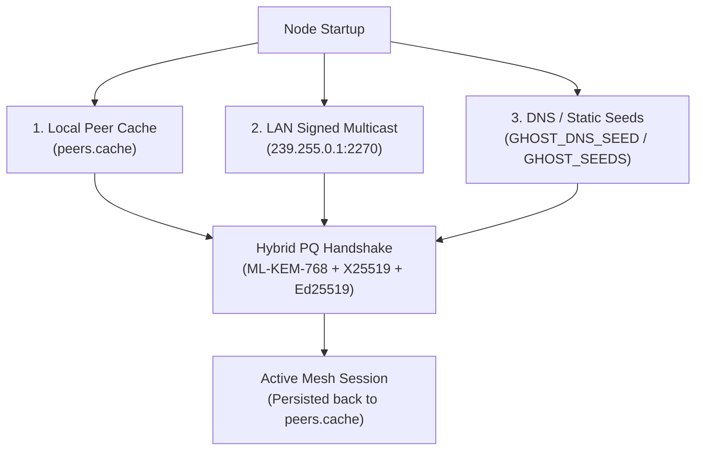

# Vantablack — Operator & Configuration Guide

This guide covers installing, configuring, and operating a Vantablack node across desktop, headless server, and container environments — including zero-cost peer discovery, private pre-shared key meshes, SOCKS5 egress routing, and the complete environment variable reference.

---

## 1. Deployment Topologies

Vantablack runs a single unified binary (`vantablack` / `ggn`) that adapts its role based on runtime flags or environment variables:



---

## 2. Installation & First Boot

### One-Line Installers

**Windows (PowerShell):**
```powershell
irm https://vantablack.kellersystems.dev/install.ps1 | iex
```

**Linux & macOS (POSIX Shell):**
```bash
curl -sSf https://vantablack.kellersystems.dev/install.sh | sh
```

### Building from Source

```bash
# Desktop application (native frameless window + system tray + HTTP control plane)
cargo build --release

# Headless server / container daemon (zero GUI or GTK/WebKit dependencies)
cargo build --release --no-default-features
```

### Persistent Data Directory

The binary is self-contained and relocatable. All persistent state (`identity.key`, `peers.cache`, `ghost-consumer.json`, `ghost-topology.json`, and `ghost.log`) is stored in a single per-user directory:

| Platform | Default Data Directory | Override Variable |
| :--- | :--- | :--- |
| **Windows** | `%APPDATA%\GlobalGhostNet` | `GHOST_DATA_DIR` |
| **macOS** | `~/Library/Application Support/GlobalGhostNet` | `GHOST_DATA_DIR` |
| **Linux** | `~/.local/share/global-ghost-net` (`$XDG_DATA_HOME`) | `GHOST_DATA_DIR` |

---

## 3. Peer Discovery & Bootstrap Strategies

Vantablack discovers and authenticates peers using three complementary mechanisms that require zero centralized coordination servers:



### 3.1 Automatic LAN Discovery
Nodes on the same local network broadcast Ed25519-signed `GHOST_BEACON____` frames on UDP multicast `239.255.0.1:2270` (and broadcast `:2270`). Peers verify the cryptographic signature and automatically complete a hybrid post-quantum handshake.

### 3.2 Direct Static Seeds (`GHOST_SEEDS`)
To connect directly to known remote IPv4/IPv6 addresses or hostnames:
```bash
GHOST_SEEDS="198.51.100.10:2270,203.0.113.42:2270" ./vantablack
```

### 3.3 Zero-Cost Cloudflare DNS Seed Discovery (`GHOST_DNS_SEED`)
You can bootstrap a global mesh for free using standard DNS `A` / `AAAA` round-robin records on Cloudflare without running a tracker server:

1. Open the **Cloudflare Dashboard** for your domain and go to **DNS → Records**.
2. Create one or more **`A`** (or **`AAAA`**) records named `seeds` (e.g., `seeds.example.com`) pointing to the public IP addresses of your reachable nodes.
3. Set **Proxy status** to **DNS only (Grey Cloud)** — Cloudflare's orange-cloud HTTP proxy does not forward raw UDP mesh frames.
4. Configure your nodes with:
   ```env
   GHOST_DNS_SEED=seeds.example.com:2270
   ```
5. Once a node connects, verified peer endpoints are written to `peers.cache`. Subsequent restarts reconnect directly from `peers.cache` even if DNS is unreachable or blocked.

---

## 4. Private Mesh & Zero-Knowledge Membership (`GHOST_PSK`)

By default, nodes operate in open discovery mode. To lock a mesh exclusively to your own devices or organization:

```bash
# Generate a 32-byte hex secret (64 hex characters)
export GHOST_PSK="8f4b2e9c1a7d6f0345b8e1c2d9a0f4763c2b1a9e8d7f6a5b4c3d2e1f0a9b8c7d"
export GHOST_ZK_DISCOVERY=1
```

* **HKDF Key Mixing:** `GHOST_PSK` is mixed into the Layer 1 `HKDF-SHA256` handshake combiner alongside the X25519 and ML-KEM-768 shared secrets. A peer without the exact `GHOST_PSK` cannot derive a valid session key.
* **Schnorr Zero-Knowledge Beacons (`ZKPR`):** When `GHOST_ZK_DISCOVERY=1` is set, discovery beacons include a 96-byte Fiat–Shamir non-interactive Schnorr proof over Ristretto255 (`RFC 9496`) proving knowledge of `GHOST_PSK` bound to the sender's Ed25519 public key and a $\pm 300\text{ s}$ Unix timestamp window. Unauthenticated beacons are dropped before any handshake state is allocated.

---

## 5. Routing Modes: SOCKS5 Egress, Onion Circuits & Exit Nodes

### 5.1 Using the Built-In SOCKS5 Proxy
Every node starts a local SOCKS5 listener on `127.0.0.1:1080` (configurable via `GHOST_SOCKS_BIND`). Point any application, browser, or CLI tool at it:

```bash
curl --socks5-hostname 127.0.0.1:1080 https://httpbin.org/ip
```

### 5.2 Operating an Exit Node
By default, nodes refuse to egress traffic to the public internet on behalf of other peers (`deny-by-default`). To enable exit routing on a remote server:

```bash
# Allow egress to specific destinations or ports
GHOST_EXIT_ALLOWLIST="*:80,*:443,1.1.1.1:53" ./vantablack

# Or allow unrestricted internet egress for trusted private meshes
GHOST_EXIT_ALLOWLIST="any" ./vantablack
```

### 5.3 Split-Tunnel Bypass Rules
Local destinations matching your bypass list are dialed directly over your local ISP rather than traversing the mesh. Manage rules live via the Control Center (**Settings → Split Tunnel**) or `POST /api/settings`:
* Exact hostnames: `intranet.local`
* Domain wildcards: `*.streaming.example.com`
* IPv4 / CIDR blocks: `192.168.0.0/16`, `10.0.0.0/8`

---

## 6. Interactive Console Commands

When running in an interactive terminal, type `HELP` or any of the following commands:

| Command | Arguments | Description |
| :--- | :--- | :--- |
| `STATUS` | — | Display node fingerprint, bind address, active sessions, and relay status |
| `PEERS` | — | List all discovered and connected peers with fingerprints and endpoints |
| `PEER` | `<ip:port>` | Initiate an immediate discovery beacon and hybrid handshake with `<ip:port>` |
| `STATS` | — | Show packet counters, Reed-Solomon reconstruction metrics, and replay drops |
| `CHAT` | `<fp> <msg>` | Send an end-to-end encrypted direct message to peer fingerprint `<fp>` |
| `SHARE` | `<fp> <path>` | Transfer a file across the sharded mesh to peer `<fp>` |
| `ONION` | `<fp1,fp2,fp3>` | Configure explicit multi-hop onion relay circuit hops |
| `EXIT` | `<fp>` | Select peer `<fp>` as the active SOCKS5 internet exit gateway |
| `LEASES` | — | *(VPN Hub)* Inspect active virtual IP leases and client session counters |
| `VPNSTATS` | — | *(VPN Hub/Client)* Display TUN interface and userspace netstack counters |

---

## 7. Control Center REST API (`127.0.0.1:2270`)

The HTTP control plane serves both the interactive dashboard and programmatic JSON endpoints:

| Endpoint | Method | Description |
| :--- | :---: | :--- |
| `/` or `/dashboard` | `GET` | Interactive dark-mode Control Center UI |
| `/api/status` | `GET` | Real-time node telemetry, throughput, active carrier paths, and peer list |
| `/api/peers` | `GET` | Detailed peer table with presence state (`online`, `idle`, `offline`) |
| `/api/peers/rename` | `POST` | Assign a friendly label to a peer fingerprint (`{"fingerprint", "name"}`) |
| `/api/connect` | `POST` | Toggle mesh connectivity (`{"connected": true \| false}`) |
| `/api/mode` | `POST` | Switch between `"public"` and `"private"` (device-allowlist) mesh modes |
| `/api/settings` | `GET` / `POST` | Read or update `route_mode` (`app_socks` / `system_vpn`) and `bypass` rules |
| `/api/speedtest` | `POST` | Run a live encrypt → RS(2,1) shard → 2-of-3 reconstruct → decrypt benchmark |
| `/healthz` | `GET` | Liveness probe returning `200 OK` |
| `/metrics` | `GET` | Prometheus-formatted telemetry counters |

> **Security Note:** Set `GHOST_PIN=<secret>` on shared networks to require an `X-Pin` authentication header on all state-changing `POST` endpoints.

---

## 8. Complete Configuration Reference (`GHOST_*`)

All parameters can be passed as environment variables or placed in a `config.env` file in the working directory (see [`docs/config.env.example`](config.env.example)):

| Variable | Default | Description |
| :--- | :--- | :--- |
| `GHOST_BIND` | `0.0.0.0:0` | Local UDP socket address for mesh data transport |
| `GHOST_WEB_PORT` | `2270` | Local HTTP port for the Control Center UI and REST API (`0` disables) |
| `GHOST_PIN` | *(unset)* | Require matching `X-Pin` header on all Control Center `POST` endpoints |
| `GHOST_NO_GUI` | `0` | Run headless without opening the native desktop window (`1` = headless) |
| `GHOST_SOCKS_BIND` | `127.0.0.1:1080` | Local SOCKS5 proxy bind address (`off` disables SOCKS5 listener) |
| `GHOST_SEEDS` | *(unset)* | Comma-separated list of bootstrap peer `host:port` endpoints |
| `GHOST_DNS_SEED` | *(unset)* | DNS `A`/`AAAA` hostname (`seeds.domain.com:2270`) for zero-cost discovery |
| `GHOST_PSK` | *(unset)* | 64-character hex (32-byte) pre-shared key for private mesh isolation |
| `GHOST_ZK_DISCOVERY` | `0` | Require Schnorr zero-knowledge membership proofs on beacons (`1` = enforce) |
| `GHOST_RELAY` | `0` | Advertise blind relay capability (`RLYC`) and forward transit frames (`1` = on) |
| `GHOST_TRANSIT_MBPS` | `10` | Maximum transit bandwidth ceiling (Mbps) allocated to relayed peers |
| `GHOST_EXIT_ALLOWLIST` | *(deny all)* | Comma-separated `host:port` rules or `any` to permit exit node egress |
| `GHOST_ONION_HOPS` | *(auto)* | Comma-separated relay fingerprints for explicit 3-hop onion circuits |
| `GHOST_COVER_TRAFFIC` | `1` | Emit Poisson-distributed encrypted dummy frames (`0` disables cover stream) |
| `GHOST_STUN_SERVERS` | *(built-in)* | Comma-separated RFC 8489 STUN servers for public endpoint discovery |
| `GHOST_TURN_SERVER` | *(unset)* | Optional RFC 8656 TURN relay (`host:port`) with `GHOST_TURN_USER` / `GHOST_TURN_PASS` |
| `GHOST_VPN` | *(unset)* | Enable Layer 2/3 VPN mode: `hub` (LAN gateway) or `client` (TUN endpoint) |
| `GHOST_VPN_HUB_FP` | *(unset)* | *(VPN Client)* 16-hex-char fingerprint of the target VPN Hub |
| `GHOST_VPN_LOCAL_IP` | `10.66.0.10` | *(VPN Client)* Static overlay IPv4 address assigned to the local TUN adapter |
| `GHOST_VPN_CLIENTS` | *(deny all)* | *(VPN Hub)* Comma-separated allowlist of client fingerprints permitted on the hub |
| `GHOST_VPN_LAN_SUBNET`| `192.168.1.0/24`| *(VPN Hub)* Physical LAN subnet routed through the hub's userspace netstack |
| `GHOST_DATA_DIR` | *(OS default)* | Override directory for `identity.key`, `peers.cache`, and JSON state files |
| `GHOST_LOG` | `ghost.log` | Log file path (`off` disables file logging) |
