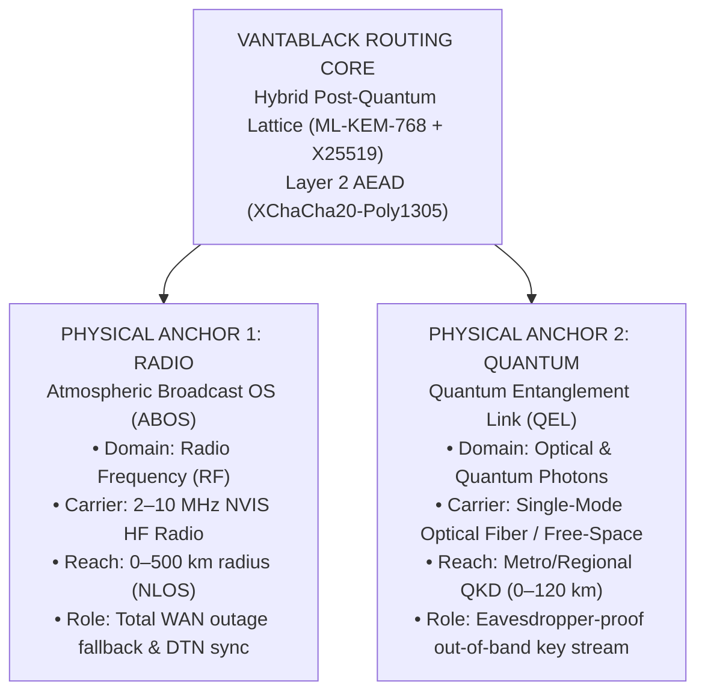
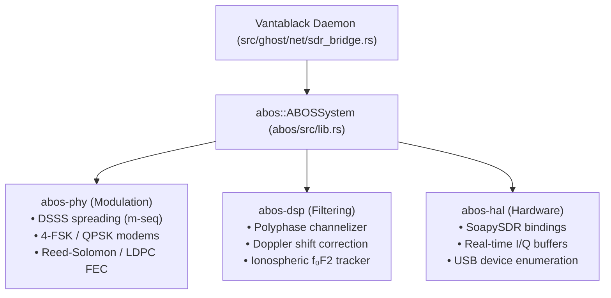
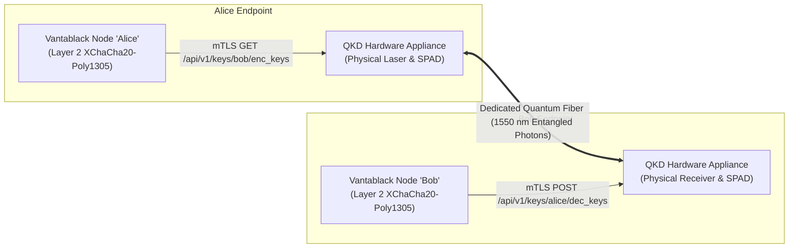
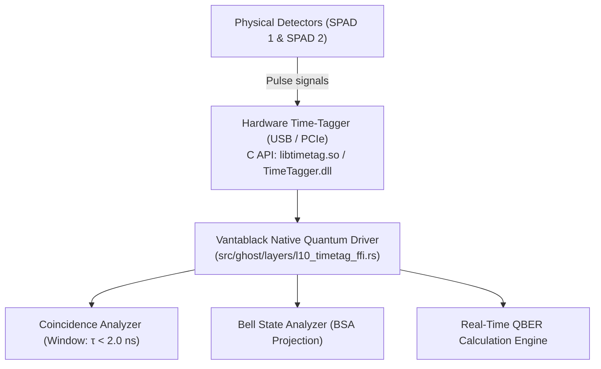
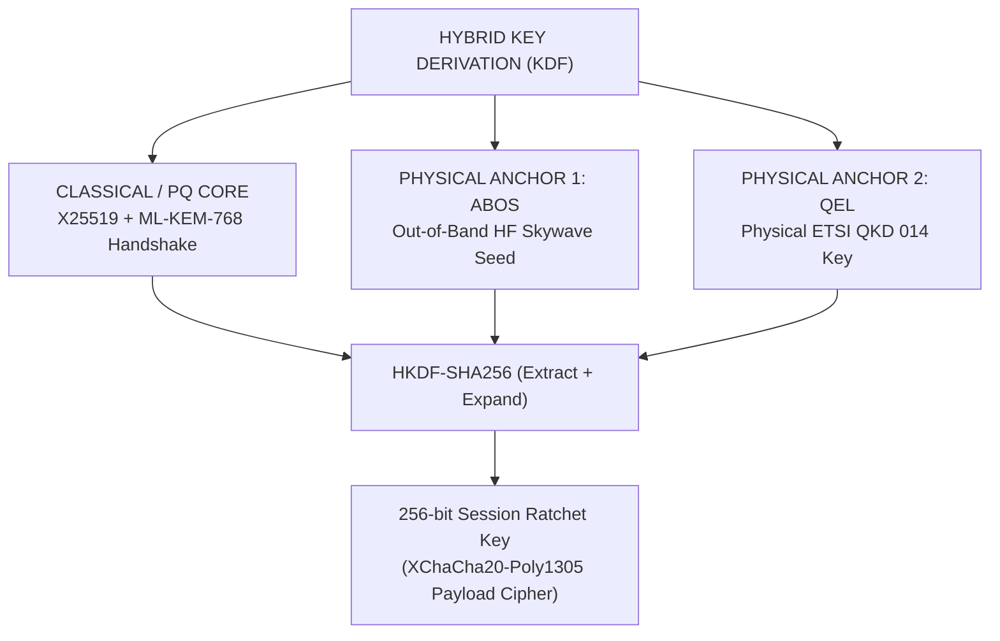

# Physical Anchors: Production Engineering & Real-World Integration Guide
## Transitioning ABOS (Atmospheric Radio) & QEL (Quantum Entanglement) from Simulation to Operational Physical Hardware in Vantablack

> **Audience:** Core Systems Engineers, Embedded Developers, Cryptographers, and Hardware Architects  
> **Target Subsystems:**  
> 1. **Anchor 1 (Radio):** Atmospheric Broadcast OS (ABOS) — HF NVIS Ionospheric Carrier  
> 2. **Anchor 2 (Quantum):** Quantum Entanglement Link (QEL) — Physical QKD, BSA & Optical Entanglement  
> **Target Repository:** `c:\Users\LNegenborn\Documents\antigravity\bold-archimedes`

---

## 1. Architectural Vision: The Physical Anchor Hierarchy

Vantablack is designed to remain operational when terrestrial fiber, cellular towers (5G/LTE), and centralized satellite downlinks are disabled, intercepted, or physically destroyed.

To achieve true physical sovereignty, the system relies on two orthogonal physical transport anchors:



---

## 2. Anchor 1: Building Real-World ABOS (Radio Skywave Carrier)

### 2.1 The Gap: Current State vs. Production Hardware
- **Current State (shipped):** `src/ghost/net/sdr_bridge.rs` is a working bridge — one
  process-wide `SkywaveBridge`, a dedicated DSP actor thread owning the `!Send`
  `abos::ABOSSystem`, live telemetry, an ingress drain task, three egress arms in
  the daemon, and a real fallback rung. What it transmits over, though, is a
  **virtual loopback UDP carrier** (`127.0.0.1:0`, override with
  `GHOST_SKYWAVE_UDP`), and ABOS's SDR drivers are simulation stubs.
- **Target State:** Live physical transmission and reception of Vantablack Ghost
  Transport Frames (GTF) over High Frequency (HF) radio waves bounced off the
  ionosphere's F2 layer. This section is the plan for that; none of it is done.

### 2.2 Physical Hardware Bill of Materials (BOM)
To deploy a functional physical ABOS node, assemble:
1. **Software Defined Radio (SDR) Transceiver:**
   - *Entry/Hobbyist:* **HackRF One** (1 MHz – 6 GHz, Half-Duplex, 8-bit ADC) with TCXO clock.
   - *Production/Recommended:* **LimeSDR USB** or **Ettus USRP B205mini** (Full Duplex, 12-bit ADC, higher dynamic range essential for noisy HF bands).
   - *Dedicated HF Alternative:* **Hermes-Lite 2** (Direct sampling QRP HF transceiver, 5W output, built specifically for 1.8–30 MHz).
2. **HF Power Amplifier (PA):**
   - 10W to 50W linear RF amplifier covering 2–10 MHz (e.g., Minipa50, Hardrock-50).
3. **NVIS Antenna System:**
   - Low-hanging horizontal dipole antenna mounted **0.1λ to 0.2λ above ground** (approx. 3–5 meters high for 5 MHz / 60m band).
   - 1:1 or 4:1 Balun and impedance tuner (ATU) to achieve VSWR < 1.5:1.

### 2.3 Software & Driver Architecture (`abos/` Crates)
The existing local `abos/` workspace already contains the crate architecture. To make it communicate with physical hardware:



#### Step-by-Step Code Implementation for ABOS Hardware:
1. **Enable SoapySDR in `abos/abos-hal`:**
   In `abos/abos-hal/Cargo.toml`, add:
   ```toml
   [dependencies]
   soapysdr = "0.4"
   ```
2. **Implement the Physical I/Q Streamer (`abos-hal/src/soapy.rs`):**
   Replace mock sample generation with real device acquisition:
   ```rust
   use soapysdr::{Device, Direction, Stream};

   pub struct PhysicalSdrDevice {
       dev: Device,
       stream_rx: Stream<num_complex::Complex32>,
       stream_tx: Stream<num_complex::Complex32>,
   }

   impl PhysicalSdrDevice {
       pub fn open(filter: &str, sample_rate: f64, freq_hz: f64) -> Result<Self, String> {
           let dev = Device::new(filter).map_err(|e| e.to_string())?;
           dev.set_frequency(Direction::Rx, 0, freq_hz, ()).map_err(|e| e.to_string())?;
           dev.set_sample_rate(Direction::Rx, 0, sample_rate).map_err(|e| e.to_string())?;
           let stream_rx = dev.rx_stream::<num_complex::Complex32>(&[0]).map_err(|e| e.to_string())?;
           let stream_tx = dev.tx_stream::<num_complex::Complex32>(&[0]).map_err(|e| e.to_string())?;
           Ok(Self { dev, stream_rx, stream_tx })
       }
   }
   ```
3. **Bridge Vantablack Packets to SDR Frames:**
   In `src/ghost/net/sdr_bridge.rs`, connect `SdrBridgeController::send_packet()` directly to the ABOS physical frame encoder:
   ```rust
   #[cfg(feature = "sdr")]
   pub async fn transmit_gtf_frame(&self, raw_gtf_bytes: &[u8]) -> Result<(), SdrBridgeError> {
       let mut abos = self.abos_system.lock().await;
       // 1. Apply FEC (Reed-Solomon / LDPC)
       let protected_payload = abos.fec.encode(raw_gtf_bytes);
       // 2. Modulate into DSSS complex baseband samples
       let iq_samples = abos.phy.modulate(&protected_payload);
       // 3. Emit through physical SDR DAC
       abos.hal.transmit_burst(&iq_samples).await
           .map_err(|e| SdrBridgeError::HardwareError(e.to_string()))?;
       Ok(())
   }
   ```

---

## 3. Anchor 2: Building Real-World QEL (From Simulation to Physical Quantum Links)

### 3.1 The Reality of Quantum Hardware
A classical microprocessor cannot directly generate or detect single entangled photons. In production, quantum communication networks connect classical cryptographic engines to **dedicated optical quantum hardware**:
1. **Alice & Bob Nodes:** Each possesses a Classical Host (running Vantablack) connected via high-speed USB/PCIe/Ethernet to a **QKD Optical Appliance** or **Photon Detection Unit**.
2. **Quantum Optical Channel:** Dedicated dark fiber or wavelength-division multiplexed (WDM) fiber transporting 1550 nm single photons.
3. **Classical Public Channel:** Standard network link (or Vantablack mesh) for basis reconciliation, error estimation, and privacy amplification.

To integrate QEL into Vantablack as a **real, operating physical anchor**, we implement two production-grade pathways:

---

### Pathway A: Commercial & Open QKD Hardware Interface (ETSI GS QKD 014 API)

The international standard for connecting production software (VPNs, firewalls, and routers) to real quantum physical hardware is **ETSI GS QKD 014** (Key Delivery API).

Commercial quantum hardware (Toshiba QKD, ID Quantique Clavis/Cerberis, Quside, KETS) exposes this exact standardized REST/gRPC API.



#### Status: shipped as a client, unverified against hardware

This is **no longer a sketch** — the client exists, at
`src/ghost/layers/l10_qel_etsi.rs`, and is the second backend of the same
`QuantumAnchorController` (select it with `GHOST_QEL_BACKEND=etsi014`). It is not
the `reqwest`-based sketch above; it is a small HTTP/1.1 implementation over
`tokio::net::TcpStream` and `tokio-rustls`, because mutual TLS with a private CA
and a client certificate is the part of this standard that must not be delegated
to a default HTTP client's config discovery. Three details from the standard are
worth calling out, because a naive client gets each of them wrong:

- **`Get key` consumes the key.** So nothing retries, and a timeout is reported
  as *"a key may have been consumed"* rather than as a clean failure.
- **The key size is vendor policy** between `min_key_size` and `max_key_size`.
  The delivered material is HKDF'd to the 32 bytes a session epoch needs, salted
  with the key ID, so a 128-bit key still yields a full epoch key and the same
  material under two IDs never yields the same one.
- **The path segment is the *other* party's SAE ID** — `enc_keys` names the peer,
  and so does `dec_keys`. SAE IDs are operator-assigned and cannot be derived from
  a fingerprint, so an unmapped peer is reported rather than guessed at.

The **label** the two nodes exchange is the standard's `key_ID`, carried in the
signed session-mix PDU — which is exactly the notification channel the standard
declares out of scope and leaves to the application. Key material never crosses
the Vantablack link.

See `ANCHORS_CODEBASE_INTEGRATION.md` §2.4 for the full configuration table
(`GHOST_QKD_KME_URL`, `GHOST_QKD_SAE_ID`, `GHOST_QKD_SAE_MAP`,
`GHOST_QKD_CA_PEM`, the mTLS pair, `GHOST_QKD_KEY_BITS`, `GHOST_QKD_INSECURE`)
and §8 for what is *not* claimed. The short version: the wire format is verified
against a mock appliance, and **no real appliance has been tested against** — so
treat the first contact with production hardware as commissioning, not as a
regression test. Vendors differ exactly where the standard is silent.

---

### Pathway B: Direct Laboratory / Embedded Quantum Hardware Interface (TDC & Single-Photon Counters)

If building direct benchtop quantum hardware without commercial appliances:

#### Physical Hardware Bill of Materials:
1. **Entangled Photon Pair Source (EPR Source):**
   - 405 nm Continuous Wave (CW) Laser Diode pumping a periodically poled potassium titanyl phosphate (**PPKTP**) or lithium niobate (**PPLN**) crystal inside a Sagnac interferometer to produce polarization-entangled photon pairs at 810 nm or 1550 nm ($|\Phi^+
angle = rac{1}{\sqrt{2}}(|HH
angle + |VV
angle)$).
2. **Single-Photon Detectors:**
   - Silicon Single-Photon Avalanche Diodes (**SPADs**, for 810 nm) or Superconducting Nanowire Single-Photon Detectors (**SNSPDs**, for 1550 nm telecommunication fiber).
3. **Time-to-Digital Converter (TDC / Time-Tagger):**
   - High-resolution hardware time tagger (e.g., Swabian Instruments Time Tagger 20, qutools quTAU, or FPGA-based TDC on Xilinx Zynq).
   - Sub-100 picosecond resolution for coincidence detection.

#### What to Build in Rust:
Create a C-FFI / USB driver that reads raw time-tag events from the physical TDC hardware:


When coincidence pulses arrive simultaneously on detectors A and B within a 2-nanosecond window, the driver registers a verified Bell detection event. If error rate $	ext{QBER} < 11\%$, the bits are distilled and loaded into Vantablack.

---

## 4. Full Daemon Integration: The Dual-Entropy Ratchet

> **Read this before the diagram.** The ratchet in this repository is
> **HKDF-SHA256**; it has no BLAKE3 dependency, and there is no
> `blake3::Hasher::new_keyed(&self.chain_key)` anywhere in the tree. The
> quantum-entropy seam that *does* exist is described below, and it **is**
> called from the live session path: when a peer connects, the daemon routes,
> distils and contracts the next epoch (`ANCHORS_CODEBASE_INTEGRATION.md` §5.1).

To make both ABOS and QEL live operational anchors in the running Vantablack engine, wire them into **`src/ghost/session/ratchet.rs`**. The quantum half of that wiring is already built:



### Concrete Code as Shipped

`src/ghost/layers/l1_kem.rs` — domain-separated from every other KDF use, so a
quantum key can never stand in for a ratchet root or an epoch key:

```rust
pub const RATCHET_QUANTUM_MIX_INFO: &[u8] = b"GHOST_NET_RATCHET_QEL_ENTROPY_v1";

/// Returns (next_root_key, chain_initiator_to_responder, chain_responder_to_initiator),
/// the same shape as `kdf_rk_hybrid`, so the caller reseeds the chains exactly
/// as a DH step would.
pub fn kdf_rk_quantum_mix(
    root_key: &[u8; 32],
    quantum_key: &[u8; 32],
) -> ([u8; 32], [u8; 32], [u8; 32]);
```

`src/ghost/session/ratchet.rs`:

```rust
impl SessionRatchet {
    /// Both peers must call this with the same key in the same epoch, or their
    /// chains diverge. Retires the current epoch (kept in the normal grace
    /// window, so in-flight frames still open), reseeds both chains, and bumps
    /// the epoch counter. Returns the new epoch number.
    pub fn mix_quantum_entropy(&mut self, quantum_key: &[u8; 32]) -> u64;
}
```

The mixing is one-way: the output reveals nothing about the quantum key, and
the quantum key alone recovers nothing without the prior root.

**Status of the wiring (do not overstate it):** probe → obtain a key for the
connected peer → mix on agreement is shipped and tested, so a live session does
contract an epoch from quantum entropy. What depends on which backend you run is
the key's **provenance**:

- `GHOST_QEL_BACKEND=sim` (the default) derives the key from a *simulated* noise
  model, not from a photon measurement, and the label that names it travels in the
  signed mix PDU — so the mix contributes structural entropy and epoch agreement,
  not secrecy.
- `GHOST_QEL_BACKEND=etsi014` (`--features qkd-tls`) instead fetches the key from a
  **real QKD appliance** over the ETSI GS QKD 014 key-delivery API. Same controller
  seam, same `acquire_key`/`redeem_key` pair, same ratchet mix — the label is the
  appliance's `key_ID` instead of a derivation label, and the key is one neither
  peer chose. This is the path that makes the key secret, and it is *built*; what
  it has not had is hardware.

A session that mixes a simulated key still reaches the same epoch on both sides.
A session that mixes an appliance key reaches the same epoch on both sides *and*
adds entropy a third party does not have.

To be exact about how little the simulated path adds: its key is not merely
weak, it is **the same bytes for every session** — the engine returns Alice's
seeded sifted bit stream, so everything above the cutoff maps to one key under the
constant seed. That is why the simulated mix is best understood as an epoch
*agreement* mechanism (`ANCHORS_CODEBASE_INTEGRATION.md` §2.3 and §8), and why the
appliance backend is the one that changes the security argument.

Route fidelity is capped by the dark-count floor at ≈0.85, below the BB84 cutoff
(just past F 0.87), so the daemon distils with this library's own BBSSW rounds
before deriving. See `ANCHORS_CODEBASE_INTEGRATION.md` §2.3 for the measured
numbers.

---

## 5. Step-by-Step Implementation Roadmap

| Phase | Subsystem | Action Required | Status |
|---|---|---|---|
| **Phase 0** | **Software anchors** | Skywave ladder rung + bridge + virtual carrier, QEL controller + JSON contract, anchors control-plane surface | **Shipped, tested, experimental (in-simulation)** |
| **Phase 1** | **ABOS Hardware** | Connect HackRF / LimeSDR via `soapysdr` in `abos-hal` (drivers are zero-fill stubs today) | Ready to build |
| **Phase 2** | **ABOS RF Link** | Test physical 2-node NVIS transmission on 5.35 MHz with 10W PA | Field test |
| **Phase 3** | **QEL ETSI API** | Implement the ETSI GS QKD 014 client as a second `QuantumAnchorController` backend | **Shipped as a client** (`GHOST_QEL_BACKEND=etsi014`, `--features qkd-tls`); verified against a mock appliance, awaiting hardware |
| **Phase 4** | **QEL Ratchet Injection** | Call `SessionRatchet::mix_quantum_entropy` from the live session path (probe → route → distil → mix) | **Shipped, tested, experimental (in-simulation)** |
| **Phase 5** | **Anchor Telemetry** | Extend `/api/v1/anchors/status` with per-session key provenance | Architecture ready |

---

## 6. How to Run the Emulated Hardware Test Today

While hardware is being assembled, you can run the complete physical anchor integration locally:

1. **Install the QEL engine once:**
   ```bash
   cd "Quantum Entanglement Link"
   pip install -e .
   ```
   There is no `--output-keys` flag: key material is produced per route by
   `ghost-net --json-output`, not dumped to a file.
2. **Start the daemon with both anchors opted in:**
   ```bash
   GHOST_NO_GUI=1 GHOST_SKYWAVE=1 GHOST_QUANTUM=1 ./target/debug/vantablack.exe
   # or: ggn --skywave --quantum
   # with the real ABOS DSP stack compiled in (still no hardware):
   cargo run --release --features "sdr" -- --skywave --quantum
   ```
3. **Verify anchor health via the control server** (default port **2270**,
   `GHOST_WEB_PORT`):
   ```bash
   curl -s http://127.0.0.1:2270/api/v1/anchors/status
   curl -s -X POST http://127.0.0.1:2270/api/v1/anchors/qel/route \
        -H 'Content-Type: application/json' \
        -d '{"from":"<fpA>","to":"<fpB>"}'
   ```
   The reachability ladder shown to operators is **Direct UDP (P0) → Mesh Relay
   (P1) → Blinded TURN (P2) → ABOS Skywave (P3)**. QEL is not a rung: it is key
   material, reported separately under `qel_quantum`.

   A peer normally reaches P3 only after P0 has failed. For a site that has no
   usable IP path at all — RF-only, severed, or not to be used — name it in
   `GHOST_SKYWAVE_ONLY=<fp>[,<fp>...]`: the peer is then never ICE-checked and P3
   is selected up front, through the same ladder with the terrestrial rungs
   withheld. Nothing else moves the peer back, and an entry that cannot name a
   peer (or names one while the carrier is unarmed) is reported at boot instead
   of being applied. `tests/skywave_fallback_e2e.rs` runs two daemons with both
   anchors on and both directions declared radio-only, and proves a chat frame
   crosses P3 in each direction.
