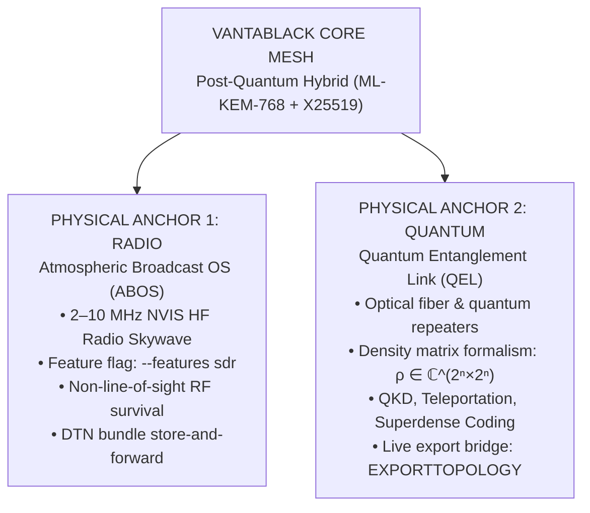
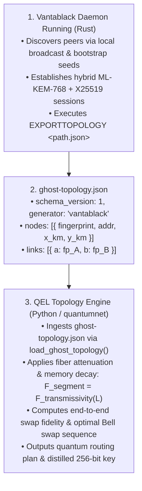

# Quantum Entanglement Link (QEL)
## Physical Optical Entanglement Routing, QKD & Ghost-Net Topology Specification

> **Subsystem Classification:** Physical Anchor 2 (Optical / Quantum Entanglement Distribution)  
> **Complementary Anchor:** [Atmospheric Broadcast OS (ABOS) Skywave Carrier](SKYWAVE_CARRIER.md) (Physical Anchor 1: Radio HF/NVIS)  
> **Maturity Status:** *Experimental.* A pure-Python simulation of QKD and
> entanglement routing — the default backend, and everything in this document.
> A second, shipped backend speaks **ETSI GS QKD 014** to a real QKD appliance
> (`src/ghost/layers/l10_qel_etsi.rs`, `GHOST_QEL_BACKEND=etsi014`); it is verified
> against a mock appliance, not against hardware. No optical hardware — and no real
> quantum channel between peers — is involved in either case here.  
> **Package Location:** [`Quantum Entanglement Link/`](../Quantum%20Entanglement%20Link/)

---

## 1. Executive Summary & Architectural Role

Vantablack is built on a multi-tiered resilience model designed to maintain secure, private communications even when conventional centralized infrastructure is compromised or physically disconnected.

While **ABOS** operates as the out-of-band **radio skywave carrier** (Priority 3 on the reachability ladder, bouncing HF packets off the ionospheric F2 plasma layer between 2–10 MHz during total terrestrial internet blackouts), **Quantum Entanglement Link (QEL)** operates as the **quantum optical transport anchor**.



QEL provides the theoretical and simulation foundations, protocol state machines, and routing optimizers for distributing quantum entanglement across participating Vantablack nodes.

---

## 2. Comprehensive Specification Breakdown (10 Pillars)

QEL implements the ten essential capabilities of quantum-networked systems:

### 1. Bell State Analysis (BSA)
- **Definition**: Mathematical and physical measurement projecting a two-qubit state into the four maximally entangled Bell states (|Φ⁺⟩, |Φ⁻⟩, |Ψ⁺⟩, |Ψ⁻⟩).
- **Role in Vantablack**: Serves as the elementary primitive for quantum teleportation and entanglement swapping.
- **Code Location**: `core/measurement.py` (`measure_bell_basis`), `protocols/bell.py`.

### 2. Quantum Key Distribution (BB84 / E91)
- **Definition**:
  - **BB84** (Prepare-and-measure): Encodes bits into non-orthogonal qubit states (Z and X bases). Sifting and Quantum Bit Error Rate (QBER) estimation detect eavesdroppers.
  - **E91** (Entanglement-based): Distributes EPR pairs to communicating parties; eavesdropping collapses entanglement, violating the CHSH Bell inequality (S > 2 confirms quantum correlation).
- **Role in Vantablack**: Supplies the 32-byte key a live session mixes into its ratchet. When a peer connects, the daemon routes over the mesh export, distils the resulting entanglement, and contracts the current epoch into the next one from that key — see `ANCHORS_CODEBASE_INTEGRATION.md` §5.1 for the exchange. The derivation is `kdf_rk_quantum_mix` in `src/ghost/layers/l1_kem.rs` over `SessionRatchet::mix_quantum_entropy`.
- **The cutoff, and why distillation is mandatory**: a route's fidelity is capped by the dark-count floor at ≈0.85 (0.8497 for a 10-metre link), while BB84 privacy amplification needs just past 0.87. **No route clears that on its own, at any distance.** `_distil_to_key_fidelity` runs this library's own BBSSW rounds over a seeded pair ensemble until the survivors clear it, and `qkd_key_hex` is derived at that post-distillation fidelity — the figure reported as `key_fidelity`. `qkd_key_hex` is `null` (and the session keeps its current epoch) only when even distillation cannot reach the cutoff.
- **Code Location**: `protocols/bb84.py`, `protocols/e91.py`.

### 3. Entanglement Swapping
- **Definition**: Establishes high-fidelity entanglement between two distant nodes (A and C) that have never directly interacted, by performing a Bell State Measurement at an intermediate repeater node (B) holding one qubit from pair (A, B) and one from pair (B, C).
- **Role in Vantablack**: Enables long-distance multi-hop entanglement distribution across arbitrary mesh topologies.
- **Code Location**: `protocols/swapping.py`, `topology/schedule.py`.

### 4. Quantum Teleportation
- **Definition**: Transfers an unknown quantum state |ψ⟩ from node A to node B using one shared Bell pair and transmitting exactly two classical bits for Pauli reconstruction.
- **Role in Vantablack**: Secure zero-leakage state transmission without physical qubit movement through untrusted space.
- **Code Location**: `protocols/teleportation.py`.

### 5. Superdense Coding
- **Definition**: Transmits two classical bits of information by sending only a single physical qubit, exploiting a pre-shared Bell pair.
- **Role in Vantablack**: Doubles the classical information carrying capacity per physical transmission over established quantum links.
- **Code Location**: `protocols/superdense.py`.

### 6. Quantum Error Correction (Shor & Steane Codes)
- **Definition**:
  - **Shor 9-qubit code**: Concatenates 3-qubit phase flip and bit flip codes to protect 1 logical qubit against arbitrary single-qubit errors (X, Y, or Z).
  - **Steane [[7,1,3]] CSS code**: Encodes 1 logical qubit across 7 physical qubits using dual classical Hamming codes, enabling fault-tolerant transversal Clifford gates.
- **Role in Vantablack**: Counters atmospheric, thermal, and optical fiber decoherence on quantum channels.
- **Code Location**: `protocols/shor.py`, `protocols/steane.py`.

### 7. No-Cloning Theorem Compliance
- **Definition**: Respects the fundamental theorem of quantum mechanics stating that an arbitrary unknown quantum state cannot be cloned.
- **Role in Vantablack**: Provides inherent immunity against packet capture, duplication, and classical replay attacks; measurement irreversibly alters the state.
- **Code Location**: Enforced through density-matrix unitary transformations and destructive projections in `core/qubit.py` and `core/measurement.py`.

### 8. High-Fidelity Entanglement Distillation
- **Definition**: Purification algorithms (BBPSSW and Deutsch protocols) that take two or more pairs of noisy, degraded Bell states and probabilistically distill a single Bell pair with significantly higher fidelity.
- **Role in Vantablack**: Cleans up decohered links across degraded long-haul fiber routes before key exchange.
- **Code Location**: `protocols/distillation.py`.

### 9. Quantum Memory Buffering
- **Definition**: Models temporary storage of quantum states in physical media (such as nitrogen-vacancy centers or trapped ions) under continuous energy relaxation (T1) and dephasing (T2) decoherence models with automated cutoff policies.
- **Role in Vantablack**: Synchronizes time delays between asynchronous entanglement generation events at different repeater stations.
- **Code Location**: `protocols/memory.py`, `core/physical.py`.

### 10. Ghost-Net Topology Integration
- **Definition**: Bridges the classical Vantablack mesh daemon with the quantum routing engine. Nodes export their live connections, public fingerprints, and positions via `EXPORTTOPOLOGY`. The topology engine then constructs a graph, models optical fiber attenuation, calculates end-to-end fidelity along candidate multi-hop paths, and determines the optimal sequence of Bell state swaps.
- **Role in Vantablack**: Real-time coupling between the operational Rust mesh and the quantum simulation/routing layer.
- **Code Location**: `topology/ghostnet.py`, `topology/routing.py`, `topology/graph.py`, `topology/visualize.py`.

---

## 3. Integration Workflow with Vantablack Daemon



---

## 4. Rust Daemon Coupling (as shipped)

The daemon drives this stack from `src/ghost/layers/l10_qel.rs`
(`QuantumAnchorController`), opt-in per process:

```bash
ggn --quantum                     # same as GHOST_QUANTUM=1
GHOST_QUANTUM=1 ./target/debug/vantablack.exe
```

**This stack is one of two backends.** The other,
`src/ghost/layers/l10_qel_etsi.rs`, is an ETSI GS QKD 014 client for a real QKD
appliance — no Python, no simulated channel, and a different claim about where the
key comes from. It is selected with `GHOST_QEL_BACKEND=etsi014` and needs
`--features qkd-tls` for an `https://` KME; see
`ANCHORS_CODEBASE_INTEGRATION.md` §2.4. Everything in this document describes the
`sim` backend, which is the default, and the two share one controller interface:
`acquire_key(topology, ours, peer)` on the starting side, `redeem_key(peer, label)`
on the answering side, with an opaque label as the only thing that travels.

**Capability probe.** At boot the controller runs `python -c "import
quantumnet"` with the QEL directory as its CWD, capped at 15 s. The result is
cached for the process lifetime in one of four states — `available`,
`degraded` (python present, import failed), `unavailable` (no python at all),
`unprobed` — and the failure is logged **exactly once**. Normal mesh operation
never re-probes.

**Route computation.** `establish_quantum_link(topology, from_fp, to_fp)`
absolutizes the topology path (the subprocess runs with a different CWD),
refuses to spawn at all when the export is missing, then runs the engine under a
45 s cap with `kill_on_drop`:

```bash
python -m quantumnet ghost-net \
    --topology <abs path to ghost-topology.json> \
    --from <fingerprint> --to <fingerprint> \
    --json-output
```

The `--json-output` contract is strict, because the Rust side parses it:
**stdout carries exactly one JSON document; every diagnostic goes to stderr.**
The failure path is still a well-formed document with `success: false` and a
non-zero exit code.

```json
{
  "success": true,
  "path": ["<fpA>", "<repeater>", "<fpB>"],
  "end_to_end_fidelity": 0.6286,
  "swap_nodes": ["<repeater>"],
  "key_fidelity": 0.8920,
  "distillation_rounds": 2,
  "qkd_key_hex": "00ff11ee…"
}
```

`end_to_end_fidelity` is the route as distributed; `key_fidelity` is the
fidelity the key was derived at, after distillation. They are deliberately
different numbers — see `ANCHORS_CODEBASE_INTEGRATION.md` §2.3.

> **A limitation worth knowing before you rely on the label.** `key_fidelity`
> names the derivation *parameters*, not the resulting bytes. `run_bb84` returns
> Alice's own seeded sifted bits with the noise level entering only through the
> QBER gate, so every fidelity from 0.872 to 0.99 yields the **same 32 bytes**
> for a given seed — and the seed is a constant. Two simulated sessions therefore
> mix the same key, and the mix's contribution in this build is epoch agreement
> rather than entropy. The `etsi014` backend does not have this property: there
> the label is an appliance `key_ID`, and each ID names one key.

The controller **fails soft**: it returns a `QelOutcome` carrying an error
string rather than propagating a failure to the daemon. A session without a
quantum key is exactly as secure as it was before this layer existed.

**Control plane** (default port **2270**, `GHOST_WEB_PORT`):

- `GET /api/v1/anchors/status` reports the anchor state, which backend is running
  (`backend.{name,engine,…}`, plus its non-secret configuration and the appliance's
  last `status` document on the `etsi014` backend), and the last successful route
  (`last_route.{path,end_to_end_fidelity,key_fidelity,distillation_rounds,
  swap_nodes,key_derived}`).
- `POST /api/v1/anchors/qel/route` with `{"from": "<fp>", "to": "<fp>"}` runs a
  real computation over the mesh export. It is PIN-gated like every mutation on
  this server, answers `400` for a malformed body, and answers `200` with
  `success: false` plus an `error` string when the anchor degrades — never a 5xx.

---

## 5. Quick-Start & Verification

To run the complete protocol test suite and live mesh integration:

```bash
# 1. Install QEL in editable mode
cd "Quantum Entanglement Link"
pip install -e .

# 2. Run protocol test suite (116 tests, including the 4 JSON-contract gates)
pytest tests/

# 3. Execute live 2-node mesh smoke test with quantum routing
bash scripts/mesh_smoke_test.sh

# 4. Interactive CLI demos
python -m quantumnet all
python -m quantumnet bb84 --bits 512 --noise 0.02
python -m quantumnet swap --noise 0.05

# 5. The exact JSON contract the Rust daemon parses
pytest tests/test_protocols/test_bridge_json.py -v

# 6. Rust controller: probe, preflight, key parsing (from the repository root)
cargo test --no-default-features --lib l10_qel

# 7. The appliance backend against a mock KME (no Python, no hardware)
cargo test --no-default-features --features qkd-tls --test qkd_etsi014_kme

# 8. Anchors control-plane surface end to end
cargo test --no-default-features --test control_center_api test_anchors_api_surface
```

> `EXPORTTOPOLOGY` must be run on the node before a route can be computed: the
> controller refuses to spawn the engine without a mesh export and answers
> immediately with `"no mesh topology export at <path>"`.
