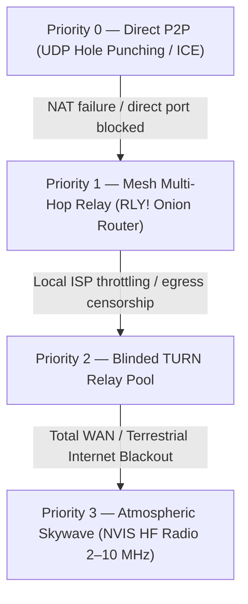
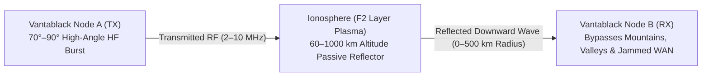

# Tactical Transports: Atmospheric Skywave (HF/SDR)
## Autonomous Out-of-Band Physical Fallback Carrier & DTN Reconciliation

> **Maturity Status:** *Experimental — in-simulation.* The shipped carrier is a
> **virtual loopback UDP channel**; the DSP stack above it is real, the radio at
> the bottom of it is not.  
> **Feature Flag:** `--features sdr` (default build: synthetic carrier only)  
> **External Subsystem:** [`KELLERBABG/ABOS`](https://github.com/KELLERBABG/ABOS) (Physical Anchor 1: Radio HF/NVIS)  
> **Complementary Anchor:** [Quantum Entanglement Link (QEL)](QUANTUM_ENTANGLEMENT_LINK.md) (Physical Anchor 2: Optical/Entanglement)  

---

## 1. Architectural Motivation

Vantablack is designed from first principles to survive hostile environments—ranging from targeted ISP DNS poisoning and Deep Packet Inspection (DPI) to coordinated terrestrial fiber cuts and complete national internet shutdowns.

Under catastrophic circumstances where standard IP routing, cellular data towers (5G/LTE), and satellite downlinks are disabled or electronically jammed, all conventional VPN and mesh protocols collapse. 

To guarantee unjammable survival, Vantablack implements an out-of-band **Physical Skywave Fallback Carrier** powered by **Atmospheric Broadcast OS (ABOS)**.



---

## 2. Atmospheric Propagation Physics

The Skywave fallback operates on High Frequency (HF) bands between **2 MHz and 10 MHz** utilizing **Near Vertical Incidence Skywave (NVIS)**:



### Key Physical Guarantees:
1. **Zero Intermediate Servers:** Radiation reflects directly off ionized atmospheric plasma layers (D, E, F1, F2). Because the atmosphere itself serves as the passive reflector, `is_relayed()` evaluates to `false`. There are no cloud intermediaries, proxy servers, or telecom operators in the signal path.
2. **Terrain Immunity:** Standard VHF/UHF tactical radios require direct line-of-sight. NVIS signals radiate almost vertically (70°–90°), bouncing back downwards into valleys, urban centers, and across mountainous terrain within a 0–500 km radius without line-of-sight dead zones.
3. **Low Probability of Intercept / Detection (LPI/LPD):** Packets are spread across frequencies using Direct Sequence Spread Spectrum (DSSS) and pseudo-random frequency hopping (FHSS), submerging the signal beneath the atmospheric thermal noise floor (SNR < 0 dB).

---

## 3. Software Architecture & Cross-Layer Bridge

To maintain zero overhead and high performance for standard WAN deployments, the Skywave carrier is completely decoupled into an opt-in cargo feature — and ABOS is consumed as a **path dependency on the vendored `abos/` workspace**, not from a remote:

```toml
# Cargo.toml
[dependencies]
abos = { path = "abos", optional = true }

[features]
sdr = ["dep:abos"]
```

> A `path` + `git` pair on the same dependency is ambiguous and makes cargo
> refuse to build at all; the `path` form above is the only one in the tree.
> With the feature off, nothing under `abos/` is compiled and ABOS types do not
> exist in the binary.

### Activation

```bash
ggn --skywave                 # same as GHOST_SKYWAVE=1
GHOST_SKYWAVE=1 ./target/debug/vantablack.exe
```

On startup the daemon installs one process-wide `SkywaveBridge`, activates the
carrier, and spawns the ingress drain task that feeds received frames back into
the node. The bridge is only reachable through `SkywaveBridge::global()`.

Because `abos::ABOSSystem` is `!Send` (it holds `dyn SDRDevice` handles and
`ThreadRng`-backed stealth injectors), the bridge **confines it to a dedicated
DSP actor thread** and speaks to it over a channel; the public `SkywaveBridge`
is `Send + Sync`. When the `sdr` feature is off, no actor is started and the
bridge self-reports as `synthetic`.

### The virtual carrier

Without radio hardware there is nothing to write to, so the bridge can bind a
**virtual carrier** — a UDP socket that stands in for the RF channel. By
default it binds `127.0.0.1:0` (loopback, ephemeral): frames loop back to the
same node, which is exactly what the carrier tests exercise.

| `GHOST_SKYWAVE_UDP` | Behaviour |
|---|---|
| unset | bind `127.0.0.1:0` — loopback ephemeral (default; the only mode used in tests) |
| `<addr:port>` | bind that address and loop frames back to itself |
| `<bind>\|<peer>` | bind `<bind>` and ship frames to `<peer>` (two-node case) |

The carrier is loopback-only unless an operator explicitly overrides it, so a
misconfigured environment cannot silently turn the daemon into an open
reflector.

### Declaring a peer radio-only

A peer reaches a fallback rung only after a real ICE check has failed, which is
the wrong answer for an RF-only site, a severed inter-domain route, or a link
that must not be used. `GHOST_SKYWAVE_ONLY=<fp>[,<fp>...]` declares those peers
to have no usable IP path:

- the declaration is resolved **through the same ladder**, with the terrestrial
  rungs withheld — it can only pre-empt the ladder's answer, never record a route
  the ladder would not itself have chosen;
- the peer is never checked, so no measurement can clear the route again, and no
  check budget is spent learning what the operator already stated;
- an entry that is not a 16-digit fingerprint, or a peer named while the carrier
  is unarmed, is reported at boot and changes nothing.

The end-to-end proof lives in `tests/skywave_fallback_e2e.rs`: two daemons, both
anchors on, a chat frame crossing the rung in both directions, asserted on the
carrier's own counters (which cover traffic cannot move) and the per-shard
routing line.

### The SDR Bridge Adapter (`src/ghost/net/sdr_bridge.rs`)
The bridge translates high-level Vantablack datagrams into raw baseband RF bursts:

1. **Ingress Serialization:** Outbound 576-byte Ghost Transport Frames (GTF) are extracted from the packet ring buffer.
2. **FEC Encoding:** Frames pass through Low-Density Parity-Check (LDPC) coding and matrix interleaving to tolerate burst atmospheric static and lightning noise.
3. **Modulation:** Complex I/Q baseband samples are synthesized via Orthogonal Frequency Division Multiplexing (OFDM) or Direct Sequence Spread Spectrum (DSSS).
4. **RF Dispatch:** Modulated bursts are pushed to the hardware transceiver queue.

---

## 4. Delay-Tolerant Networking (DTN) & Phoenix Windows

High-frequency radio channels are inherently intermittent. Ionospheric density shifts diurnal cycles, geomagnetic storms produce absorption blackouts, and solar flares degrade high frequencies.

Vantablack bridges this physical reality using **Delay-Tolerant Networking (DTN)**:

* **Bundle Serialization:** During complete disconnection, outgoing states (Merkle tree heads, cryptographic capability vouchers, and peer heartbeat vectors) are buffered into durable `DtnBundle` structures on disk.
* **Phoenix Windows:** When an ionospheric opening or transient meteor trail (meteor scatter ionization) is detected, the carrier opens an opportunistic "Phoenix Window", flushing prioritized DTN bundles in micro-burst transmissions before the ionospheric channel closes.

---

## 5. Telemetry & Observability

When compiled with `--features sdr`, operators can inspect live skywave status through both the CLI and local REST API:

### CLI Command
```bash
ggn sdr-status
```
**Output (real):**
```text
Atmospheric Broadcast OS (ABOS) Skywave Interface:
  Carrier Band: 2–10 MHz (NVIS Skywave)
  Propagation: 70°–90° Near-Vertical Incidence (Zero Skip Zone)
  Modulation: DSSS below-noise + LDPC(256/512)
  Status: Disabled (compile with --features sdr)
```

### Control API (`GET /api/v1/anchors/status`)

The live carrier telemetry is part of the anchors surface on the control port
(default **2270**, `GHOST_WEB_PORT`):

```json
{
  "abos_skywave": {
    "status": "online",
    "synthetic": true,
    "carrier_freq_hz": 5350000,
    "estimated_f0f2_hz": 0.0,
    "dsss_processing_gain_db": 0.0,
    "tx_packets": 0,
    "rx_packets": 0,
    "tx_dsp_bytes": 0,
    "meteor_burst_window_open": false,
    "virtual_carrier": "127.0.0.1:54123",
    "virtual_carrier_peer": null
  }
}
```

`synthetic` is `true` whenever the build has no `sdr` feature — the surface
never claims hardware it does not have. A daemon started without the bridge
reports `{"status": "offline"}` instead.

---

## 6. Implementation Status & Roadmap

To maintain engineering transparency, the ABOS physical integration is structured in two distinct phases:

| Component | Status | Implementation Details |
| :--- | :--- | :--- |
| **Reachability ladder** | **Shipped, tested** | `FallbackPath::Skywave` is the last rung, selected only when the bridge reports an NVIS frequency (`nvis_freq_khz()`); never chosen by an unconfigured daemon |
| **Vantablack bridge** | **Shipped, tested** | One process-wide bridge, ingress drain task, three egress arms, virtual carrier, telemetry, CLI & API hooks |
| **DSP & PHY math** | **In ABOS, simulated** | OFDM, LDPC FEC, Costas loop, Gardner timing, DSSS — real code, no verified RF |
| **Protocol framing** | **In ABOS, simulated** | Burst headers, sharding, CRC32, timestamp sync |
| **Transport in the default build** | **Virtual loopback UDP** | `127.0.0.1:0` unless `GHOST_SKYWAVE_UDP` overrides it |
| **SDR hardware HAL** | **Simulation stubs** | Zero-fill reads. Real drivers (LimeSDR / HackRF / USRP) are *not* implemented; no over-the-air behaviour has been verified |

Developers interested in contributing to the DSP algorithms, radio frequency hardware drivers, or ionospheric sounding models can review the standalone repository at:  
[**https://github.com/KELLERBABG/ABOS**](https://github.com/KELLERBABG/ABOS)
