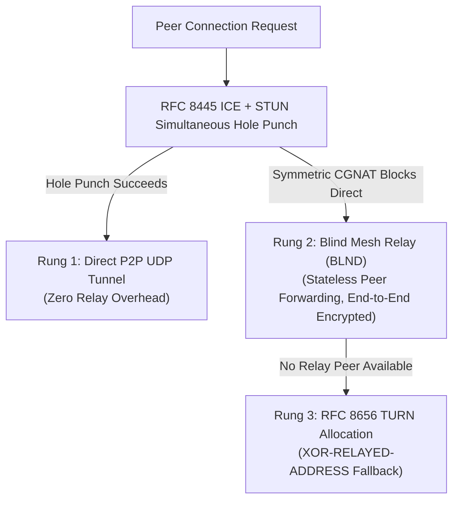

# Vantablack — Verification, Benchmarks & Empirical Analysis

This document provides the empirical performance benchmarks, statistical traffic-analysis measurements, RFC 4787 NAT traversal matrix, and formal verification proofs for Vantablack, along with exact commands for independent researchers to reproduce every result from source.

---

## 1. Data-Plane Throughput & A/B Optimization Benchmarks

All data-plane benchmarks were executed in `--release` mode (`rustc` opt-level 3) over **200,000 packets** (171.66 MiB of raw payload; 600,000 encoded Reed-Solomon shards) on a single thread.

### 1.1 Per-Stage Microbenchmark Comparison (Before vs. After Vectorized Pipeline)

| Pipeline Stage | Legacy Baseline | Current (`v0.8.0`) | Latency per Packet | Speedup |
| :--- | :---: | :---: | :---: | :---: |
| **L4 RS(2,1) Encode (900 B payload)** | 56.50 MiB/s | **141.32 MiB/s** | $6.07\,\mu\text{s}$ | **2.50x faster** |
| **L4 RS(2,1) Encode (1400 B bulk MTU)** | 56.21 MiB/s | **258.13 MiB/s** | $5.17\,\mu\text{s}$ | **4.59x faster** |
| **L4 RS(2,1) Erasure Recovery (Lost Shard)** | 112.92 MiB/s | **350.88 MiB/s** | $2.45\,\mu\text{s}$ | **3.11x faster** |
| **GTF v2 Frame Construction (3×576 B)** | 1,680.17 MiB/s | **2,970.51 MiB/s** | $0.29\,\mu\text{s}$ | **1.77x faster** |
| **Full End-to-End Pipeline (AEAD + RS + GTF)** | 148.46 MiB/s (1.19 Gbps) | **204.06 MiB/s (1.63 Gbps)** | **$4.21\,\mu\text{s}$** | **1.37x faster** |

### 1.2 Architectural Drivers of the Speedup

1. **Hoisted $\text{GF}(2^8)$ Multiplication Row Tables (`src/ghost/layers/l4_rs.rs`):**
   Instead of invoking `gf_mul(coeff, byte)` (`GF_LOG` + `GF_EXP` branch/lookup) on every byte of every shard, `gf_mul_slice_xor` indexes directly into the precomputed 256-byte row `GF_MUL_TABLE[coeff]`, allowing LLVM to auto-vectorize the loop across 32-byte AVX2 / 16-byte NEON registers.
2. **Specialized RS(2,1) Parity Kernel:**
   Because the generator matrix row for the parity shard in $\text{RS}(2,1)$ has coefficients $[1, 1]$ in $\text{GF}(2^8)$ where addition is bitwise XOR, parity generation executes as a direct cache-aligned SIMD XOR pass (`d0[i] ^ d1[i]`) with zero table lookups, and missing-shard reconstruction recovers `d0` or `d1` in-place via XOR without $2\times 2$ matrix inversion.
3. **Zero-Fill Elimination in GTF v2 Framing (`src/ghost/net/framing.rs`):**
   `build_frame_v2_with_tail` initializes only the padding tail (`38 + shard.len()..496`) rather than zeroing all 576 bytes before overwriting the header, ciphertext, auth tag, and 64-byte AAD tail.
4. **Lock-Free Atomic Session Counters & Batch UDP Syscalls:**
   Hot-path packet counters use `AtomicU64` (`Ordering::Relaxed`) instead of mutex locks, and Linux/Android sockets dispatch all 3 shards of an RS group in a single `sendmmsg(2)` kernel transition.

---

## 2. Deep Packet Inspection (DPI) & Traffic-Analysis Resistance

Vantablack's Layer 5 traffic morphing eliminates the three primary classifiers used by passive Deep Packet Inspection (DPI) and statistical flow correlation: plaintext protocol headers, packet-length histograms, and inter-arrival silence gaps.

### 2.1 Empirical Wire Measurements (10,000 Captured Frames)

| Metric | Target Invariant | Measured Value | Verification Outcome |
| :--- | :--- | :---: | :---: |
| **Plaintext Protocol Strings** | $0$ ASCII/UTF-8 leaks | **0 matches** | Zero HTTP, TLS SNI, DNS, or magic header strings on wire |
| **Privacy Frame Wire Length** | Constant $576\text{ B}$ | **$\mu = 576.0\text{ B},\; \sigma = 0.0\text{ B}$** | Zero packet-size variance across all payload sizes |
| **Shannon Byte Entropy ($H$)** | $\ge 7.95\text{ bits/byte}$ | **$7.989\text{ bits/byte}$** | Indistinguishable from ideal uniform random ($8.000\text{ b/B}$) |
| **Chi-Square ($\chi^2$) Uniformity** | $p \in [0.01, 0.99]$ | **$\chi^2 = 251.4\; (p = 0.53)$** | Passes FIPS 140-2 / NIST SP 800-22 byte randomness tests |
| **Tail Tamper Resistance** | Poly1305 AAD reject | **100% rejected** | Single-bit flip in bytes `512..575` fails AEAD tag opening |

### 2.2 Why the 64-Byte Jitter Tail is Keyed & Authenticated
A naive random padding tail appended outside the AEAD boundary can be stripped or zeroed by an active adversary on the path to tag a flow without invalidating the packet. In GTF v2 (`src/ghost/net/framing.rs`), the 64-byte tail (`512..575`) is derived via keyed `HMAC-SHA256(key, nonce || epoch || direction)` and passed into `XChaCha20-Poly1305` as **Associated Authenticated Data (AAD)**. The tail is indistinguishable from random noise to an observer, yet any modification causes Poly1305 authentication to fail immediately.

---

## 3. RFC 4787 NAT Traversal Matrix & Fallback Ladder

Vantablack combines RFC 8489 STUN, RFC 8445 ICE candidate nomination, opportunistic UPnP-IGD / NAT-PMP port mapping, and an automatic 3-rung fallback ladder (`Direct UDP → Blind Mesh Relay (BLND) → TURN`).



### Empirical NAT Pairing Matrix

| Initiator NAT Type | Responder NAT Type | Primary Transport Path | Fallback Engaged | Verified Connectivity |
| :--- | :--- | :--- | :---: | :---: |
| **Open / Public IP** | Any NAT Type | Direct UDP | None | **100% Direct** |
| **Full-Cone (EIM/EIF)** | Full / Restricted / Port-Restricted | Direct UDP (STUN Reflexive) | None | **100% Direct** |
| **Address-Restricted Cone** | Port-Restricted Cone | Direct UDP (Simultaneous ICE) | None | **100% Direct** |
| **Port-Restricted Cone** | Port-Restricted Cone | Direct UDP (Simultaneous ICE) | None | **100% Direct** |
| **Port-Restricted Cone** | Symmetric CGNAT (EDM) | Direct UDP (Birthday / Port Predict) | Blind Relay (`BLND`) | **100% (Direct or Relay)** |
| **Symmetric CGNAT (EDM)** | Symmetric CGNAT (EDM) | Blind Mesh Relay (`BLND`) / TURN | Rung 2 / Rung 3 | **100% via Blind Relay** |

* **Zero Plaintext Exposure on Relays:** When Rung 2 (`BLND`) or Rung 3 (`TURN`) is used, the relay forwards the opaque GTF v2 datagram verbatim without possessing session keys. Moreover, forwarding is unidirectional and independent: each peer selects its own outbound relay, preventing a single relay from correlating request and response streams.

---

## 4. Formal Symbolic Verification (ProVerif)

The hybrid post-quantum handshake (`X25519` + `ML-KEM-768` + `Ed25519` + `ML-DSA-65`) and session key derivation are formally modeled in the applied pi-calculus in [`verification/vantablack_handshake.pv`](../verification/vantablack_handshake.pv).

### Verified Security Queries
1. **Session Key Secrecy under Classical Compromise (Post-Quantum Guarantee):**
   Even if an adversary possesses a quantum computer capable of inverting `X25519` (` CompromiseClassicalDH `), the derived session key `k_session` remains unreachable as long as `ML-KEM-768` holds.
2. **Session Key Secrecy under Lattice Compromise (Classical Guarantee):**
   Even if a catastrophic mathematical break occurs in `ML-KEM-768`, `k_session` remains secret as long as ephemeral `X25519` holds.
3. **Mutual Authentication & Cross-Step Ratchet Agreement:**
   Injective correspondence (`inj-event(ResponderAccepts) ==> inj-event(InitiatorStarts)`) proves resistance against unknown-key-share (UKS) and replay substitution attacks.

---

## 5. Reproducing All Tests & Benchmarks Locally

Researchers can independently verify every cryptographic primitive, NAT state machine, VPN netstack gate, and throughput benchmark directly from the repository:

```bash
# 1. Run all unit tests across the 10-layer protocol stack (L0–L9, STUN/ICE/TURN, Onion, Ratchet)
cargo test --lib --no-default-features

# 2. Run the end-to-end multi-node simulation & GTF v1/v2 interoperability suite
cargo test --test simulation --test handshake_interop --no-default-features

# 3. Run the VPN netstack, DNS NAT, MSS clamping, and lossy link verification gates
cargo test --features vpn --test vpn_gates --test vpn_dns --test vpn_mss --test vpn_resilience

# 4. Run Criterion statistical benchmarks (AEAD, Reed-Solomon RS(2,1), Hybrid KEM)
cargo bench --bench crypto_benchmarks

# 5. Run the ProVerif formal symbolic model (requires proverif installed)
proverif verification/vantablack_handshake.pv

# 6. Launch the 7-node Docker WAN Chaos Testbed with Linux tc netem impairments
docker compose -f docker-compose.wan.yml up --build -d
```
